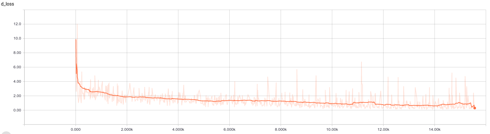
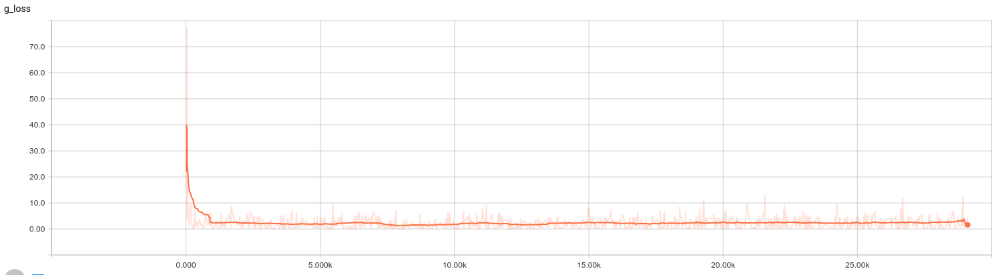

# Homework3 - Generative Models 
This is a team homework. 
In your report please list the contribution of each team member.

# Task
Your task is to modify DCGAN-tensorflow <a>https://github.com/carpedm20/DCGAN-tensorflow</a> so that it can generate images of higher resolution (256x256).

You have to submit 500 images generated by your generator. The resolution of each image is 256x256 pixels.
We will collect the images from all teams and create an evaluation dataset containing those synthetic images and some real images.

You need to run your discriminator on this evaluation dataset. We will rank each team according to the prediction results. You also have to submit a report describing your modifications and references.

# Dataset for training
The training data are from Places2 standard dataset (small images 256x256)
<a>http://places2.csail.mit.edu/challenge2016/train_256_places365standard.tar</a>

We only use images of the following classes (indoor scenes):
<b>bedroom, childs room, dining room, dorm room, hotel room, living room, recreation room, storage room, television room, and waiting room.</b>
Just for your convenience, here is a compilation of images from those clasees: 
<a>https://dl.dropboxusercontent.com/u/26848284/indoor.tgz</a> 
The link will be removed after homework due date.

# About our trained network
Our network is trained based on indoor dataset and the codes within this repository(with orginate from <a href="https://github.com/carpedm20/DCGAN-tensorflow">carpedm20</a>). The presented result here is trained for 40 epochs and 64 batch_size. We have several other results, among them, we consider this one looks like good one.

# Charts
#### d_loss

#### g_loss

# Our report of this assignment
We present our report as a <a href="HW3_Report.pdf">pdf file</a>.

# Generated Samples
Our generated 500 images from indoor dataset:
Link: <a>https://drive.google.com/open?id=0BxFvBc0crSHbRksyOVUzLTdVeEU</a> 

# Member
- 姓名：<a href="https://github.com/Timforce">李冠毅</a>　學號：104064510  
負責內容：Network evaluation，實驗討論，架構整理，報告彙整

- 姓名：<a href="https://github.com/gjlnnv">李季紘</a>　學號：(交大)0556083  
負責內容：Network training，實驗討論，架構整理，程式修訂
