# Homework3 - Generative Models

## Method
Generating photo-realistic images is one of the goals of generative model. In this homework we modify the [StackGAN](https://arxiv.org/abs/1612.03242) proposed by Zhang et al. to generate 256x256 images. 

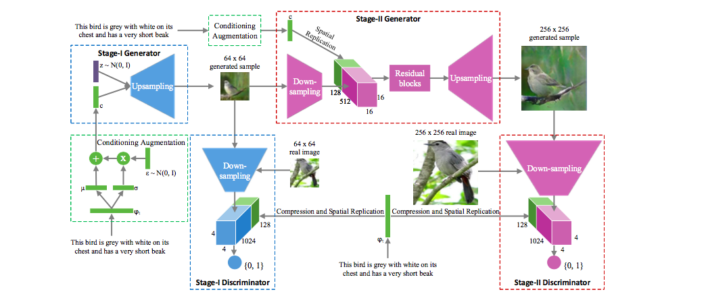

There are two stage in StackGAN. The Stage-I GAN sketches the primitive shape and basic colors of the object based on the given text description, yielding Stage-I low resolution images. The Stage-II GAN is able to rectify de- fects and add compelling details with the refinement pro- cess. Since we do not need to condition on text description, so we remove all the text-relevant component. Most of the details can be founded in ```model.py```.


## Stage 1
We directly use DCGAN implemented by [carpedm20](https://github.com/carpedm20/DCGAN-tensorflow) as our stage 1 GAN. In this stage we generate 64x64 images. Here's some code details.

### Generator
 The structure is totally identical to the one in [DCGAN-tensorflow](https://github.com/carpedm20/DCGAN-tensorflow). After project noise vector z to spatial space, we apply several transposed convolution with activation function and batch normalization. We append ```g1_``` in front of all parameter in generator 1  with variable scope "g1".

> tips: We also try to reduce kenel size like StackGAN however the generated image will become super unrealistic, so we still apply 5x5 kernel size.


```python
    def generator1(self, z):
        with tf.variable_scope("g1"):
            s = self.output_size_1
            s2, s4, s8, s16 = int(s/2), int(s/4), int(s/8), int(s/16)

            # project `z` and reshape
            self.z_, self.h0_w, self.h0_b = linear(z, self.gf_dim*8*s16*s16, 'g1_h0_lin', with_w=True)

            self.h0_1 = tf.reshape(self.z_, [-1, s16, s16, self.gf_dim*8])
            h0_1 = tf.nn.relu(self.g1_bn0(self.h0_1))

            self.h1_1, self.h1_w_1, self.h1_b_1 = deconv2d(h0_1, [self.batch_size, s8, s8, self.gf_dim*4], name='g1_h1', with_w=True)
            h1_1 = tf.nn.relu(self.g1_bn1(self.h1_1))

            h2_1, self.h2_w_1, self.h2_b_1 = deconv2d(h1_1, [self.batch_size, s4, s4, self.gf_dim*2], name='g1_h2', with_w=True)
            h2_1 = tf.nn.relu(self.g1_bn2(h2_1))

            h3_1, self.h3_w_1, self.h3_b_1 = deconv2d(h2_1, [self.batch_size, s2, s2, self.gf_dim*1], name='g1_h3', with_w=True)
            h3_1 = tf.nn.relu(self.g1_bn3(h3_1))

            h4_1, self.h4_w_1, self.h4_b_1 = deconv2d(h3_1, [self.batch_size, s, s, self.c_dim], name='g1_h4', with_w=True)
            return tf.nn.tanh(h4_1)
```

### Discriminator
Each convolutional layers are followed with batch normalization and activation function. Different from generator, we use leaky relu just like the original DCGAN paper. The output is the logit scalor indicating whether the input image is real or not. We append ```d1_``` in front of all parameter in generator 1  with variable scope "d1".

```python
    def discriminator1(self, image, reuse=False):
        with tf.variable_scope("d1"):
            if reuse:
                tf.get_variable_scope().reuse_variables()

            h0 = lrelu(conv2d(image, self.df_dim, name='d1_h0_conv'))
            h1 = lrelu(self.d1_bn1(conv2d(h0, self.df_dim*2, name='d1_h1_conv')))
            h2 = lrelu(self.d1_bn2(conv2d(h1, self.df_dim*4, name='d1_h2_conv')))
            h3 = lrelu(self.d1_bn3(conv2d(h2, self.df_dim*8, name='d1_h3_conv')))
            h4 = linear(tf.reshape(h3, [self.batch_size, -1]), 1, 'd1_h3_lin')

            return tf.nn.sigmoid(h4), h4
```

## Stage 2
We modify the stage 2 GAN proposed in paper by removing text-conditioned vextor.

### Generator
We first downsampling the image generate by stage 1 GAN to feature space which has shape 16x16x512 with two convolutional layers.

```python
    def generator2(self, image):
        with tf.variable_scope("g2"):
            s = self.output_size_2
            s2, s4, s8 = int(s/2), int(s/4), int(s/8)

            h0 = lrelu(conv2d(image, self.df_dim_2, name='g2_h0_conv'))         # [32, 32, 256]
            h1 = lrelu(self.g2_bn1(conv2d(h0, self.df_dim_2*2, name='g2_h1_conv')))     # [16, 16, 512]
```

Then we connect a series of residual block to the feature map. We use the official [StackGAN code](https://github.com/hanzhanggit/StackGAN/blob/master/stageII/model.py) us our resudual blocks. Details can be found both in the repo or ```model.py```.

```python
            h1_res = self.residual_block(h1)
```

Finally, we use a series of de-convolutional layers to generate 256x256 image.

```python
            self.h2_2, self.h2_w_2, self.h2_b_2 = deconv2d(h1_res, [self.batch_size, s8, s8, self.gf_dim_2*4], name='g2_h2', with_w=True)
            h2_2 = tf.nn.relu(self.g2_bn2(self.h2_2))   # [32, 32, 256]

            h3_2, self.h3_w_2, self.h3_b_2 = deconv2d(h2_2, [self.batch_size, s4, s4, self.gf_dim_2*2], name='g2_h3', with_w=True)
            h3_2 = tf.nn.relu(self.g2_bn3(h3_2))        # [64, 64, 128]

            h4_2, self.h4_w_2, self.h4_b_2 = deconv2d(h3_2, [self.batch_size, s2, s2, self.gf_dim_2*1], name='g2_h4', with_w=True)
            h4_2 = tf.nn.relu(self.g2_bn4(h4_2))        # [128, 128, 64]

            h5_2, self.h5_w_2, self.h5_b_2 = deconv2d(h4_2, [self.batch_size, s, s, self.c_dim], name='g2_h5', with_w=True)
            return tf.nn.tanh(h5_2)                     # [256, 256, 3]
```            

### Discriminator
We increase the concolutional layers in discriminator to serve as our stage 2 discriminator. 

```python
    def discriminator2(self, image, reuse=False):
        with tf.variable_scope("d2"):
            if reuse:
                tf.get_variable_scope().reuse_variables()

            h0 = lrelu(conv2d(image, self.df_dim, name='d2_h0_conv'))           # 128
            h1 = lrelu(self.d2_bn1(conv2d(h0, self.df_dim*2, name='d2_h1_conv')))       # 62
            h2 = lrelu(self.d2_bn2(conv2d(h1, self.df_dim*4, name='d2_h2_conv')))       # 32
            h3 = lrelu(self.d2_bn3(conv2d(h2, self.df_dim*8, name='d2_h3_conv')))       # 16
            h4 = lrelu(self.d2_bn4(conv2d(h3, self.df_dim*16, name='d2_h4_conv')))      # 8
            h5 = linear(tf.reshape(h4, [self.batch_size, -1]), 1, 'd2_h5_lin')

            return tf.nn.sigmoid(h5), h5
```            

## Train
We build 4 Adam optimizer for G & D in each stage. We activate ```d1_optim``` and ```g1_optim``` in stage 1, ```d2_optim``` and ```g2_optim``` in stage 2.

```python
d1_optim = tf.train.AdamOptimizer(config.learning_rate, beta1=config.beta1) \
                          .minimize(self.d1_loss, var_list=self.d1_vars)
g1_optim = tf.train.AdamOptimizer(config.learning_rate, beta1=config.beta1) \
                          .minimize(self.g1_loss, var_list=self.g1_vars)

d2_optim = tf.train.AdamOptimizer(config.learning_rate, beta1=config.beta1) \
                          .minimize(self.d2_loss, var_list=self.d2_vars)
g2_optim = tf.train.AdamOptimizer(config.learning_rate, beta1=config.beta1) \
                          .minimize(self.g2_loss, var_list=self.g2_vars)
```                          

Graph building and session running are similar to [DCGAN-tensorflow](https://github.com/carpedm20/DCGAN-tensorflow) while we extend it to two stage.

## Result
###Stage 1
<table border=1>
<td>
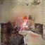
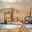
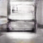
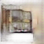
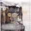
</td>
</table>

###Stage 2
<table border=1>
<td>
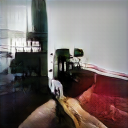
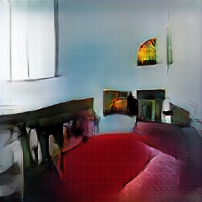
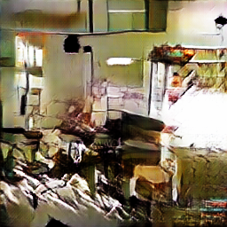
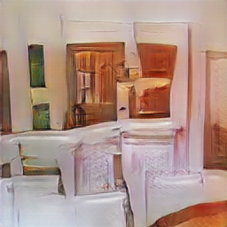
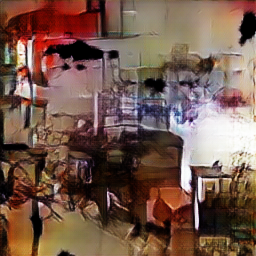
</td>
</table>

## Contribution
We survey the recent work together and found that stack gan is suitable for our task. We modify the code together with similar contribution.