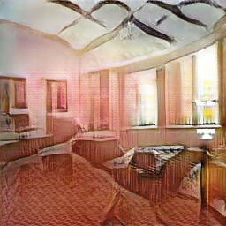
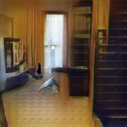

#CEDL Homework 3 Report

team member: 林沅廷, 石孟立, 王福恩, 王尊玄

##Introduction:
In this homework, we will practice to use state-of-the-art generative model (GAN) to produce higher resolution image(compared to traditional 64*64 image) In the following session, we will elucidate how we modify provided DCGAN[1] to ahieve the target resolution.

##Implementation:

* **Design idea:**
 To make DCGAN capable to generate higher resolution, the simplest way is using the same architecture as DCGAN but with 2 more deconvolution layers (picture below is the 64*64 version DCGAN generator)

However, the training process in 64x64 DCGAN is already hard enough. It's quite unrealistic to add two more deconvolution layers directly since the model might be harder to train and unstable. 
In recent works, there are many modyfied GAN architecture such as infoGAN, pixel2pixel and stackGAN. some for conditional control and some for higher resolution. In this project, we are inspired by the concept of stackGAN[2]. we propose a two stage cascaded generator architecture.  

* **Architecture of stackGAN:**
In stackGAN, the input of the generator include a random noise vector and an embedded image caption which is capable of providing conditional information about the target to be generated.

	* Stage I: 
	In stage I,the architecture is just as the DCGAN with additional input information whose purpose is generating 64x64 low resolution "sketch" of the target image with primitive color and shape. A discriminator is applied to judge the realness of this image after the generator.
	
	* Stage II:
	After stage I, the image will be downsampled to 16x16. A feature vector of the embedded caption will be concatenated after the downsmapled feature tensor. With this feature block passing through several residual blocks, it will encounter next generator whose purpose is upsampling the tensor to 256x256x3 image. Based on the sketch of stage I, stage II can refine the defects and add more detail to the image with higher resolution. A discriminator would be applied to judge the realness of the image, too!
	
* **Architecture of our model:**
	In our implementation, we don't need the conditional information(the embedded caption) in stackGAN. Therefore, our model degenerate to two stage generator with own discriminator.
	* Stage I:
	In stage I, the input is only the random noise with dimension 100. After the generator, a 64x64 sketch is produced. In the stage I discriminator, the fake image of stage I and downsampled real image are fed to judge the realness. 
	
	* Stage II:
	Before entering the second generator, the 64x64 fake image will be downsampled to 16x16 tensor. The tensor will pass through a series of residual block. The second generator will take this feature tensor as clue and upsampling it to produce 256x256 fake image. A second discriminator will be applied to judge the realness of the fake image.
	
* **The hyperparameter of the model:**

* **Training:**
	Step 1: 
	Train the stage 1 generator and discriminator for 100 epoch  
	Step 2: 
	Fix the parameter of stage 1 and train the rest part (stage2 generator + discriminator, downsampler and residual blocks) 
	Optimizer:
	In all training process, we use Adam optimizer with beta1 = 0.5 and Learning rate = 0.0002
	
##Generated data:

The full dataset with 500 generated 256x256 fake images is in the follow link
google drive link= https://drive.google.com/open?id=0B3RbJqaypz2TWDJ1U3dtNzhfVlE

* Some generated examples:

<table>
<tr>
<th></th>
<th></th>
<th></th>
<th></th>
<th></th>
</tr>
<tr>
<th></th>
<th></th>
<th></th>
<th></th>
<th></th>
</tr>
<tr>
<th></th>
<th></th>
<th></th>
<th></th>
<th></th>
</tr>
<tr>
<th></th>
<th></th>
<th></th>
<th></th>
<th></th>
</tr>
</table>

##Discussion:

* Why stackGAN
In this project, we first tried the version of cascading two more deconvolution layers after the DCGAN and the output is not that good. It seemed that the adversarial process is quite unstable in such deeper structure. If we try several experiments with the same hyperparameter setting, the outcome is some how very diverse. 
After the first version, we come up with a new idea: cascading a super resolution generative model right after the original DCGAN. However, it comes to the issue that the image produced by the 64x64 generator is not that similar to the distribution of the image with "low resolution". Thus, the outcome is not quite satisfying either. 
In the stackGAN structure, it decoupled the deeper generation process into two stages with own discriminator. With such structure, it solved the problem we encountered in version 1 implementation with one more supervision constrain during the generation process. Instead of directly upsampling the output image of stage 1, the stack structure treated the 64x64 image as the sketch of the target. In this way, it is possible for the second stage generator to improve or correct the output from stage 1.

* Training process:
In this project, we simply perform single training iteration (train stage1 => train stage2). Actually, this process can be iterate sveral times and perhaps the outcoming would be better.  
Moreover, as the training epoches increased, we found the model might collapsed that it only mapped to several certain scene. To solve this problem, we spreaded several independent training process or updated the network parameter a few iterations during inference time. 
To improve the network diversity, maybe we can adjust the architecture a little (such as ACGAN) but that's another story!

##Reference:

[1] https://arxiv.org/abs/1511.06434

[2] https://arxiv.org/abs/1612.03242
